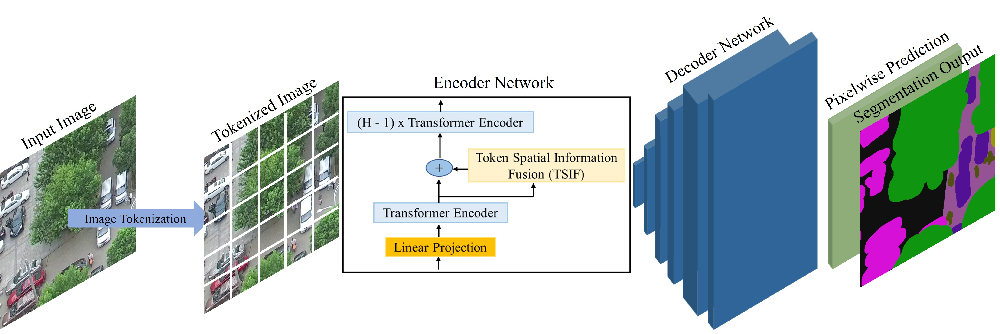
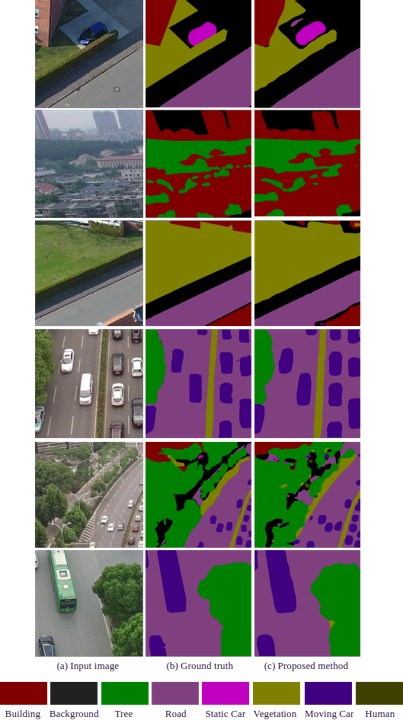
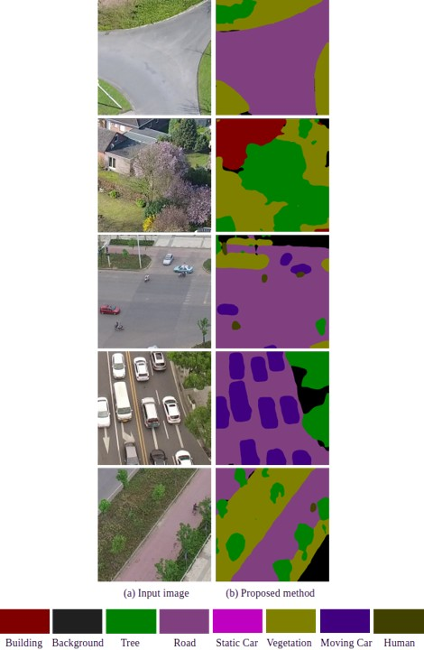
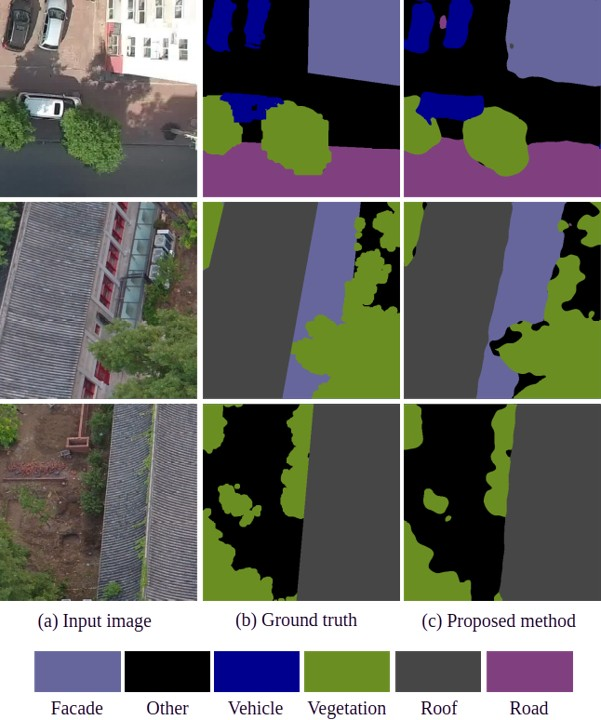

#  Semantic Segmentation of UAV Images Based on Transformer Framework with Context Information 
 

Our work can be seen in the [Semantic Segmentation of UAV Images Based on Transformer Framework with Context Information](https://www.mdpi.com/2227-7390/10/24/4735) and
[Encoder-Decoder based Segmentation Model for UAV Street Scene Images](https://ieeexplore.ieee.org/abstract/document/10043528).

- We designed a deep learning based semantic segmentation network for an Unmanned Aerial Vehicle (UAV) street scene images. 

- We construct a transformer based encoder-decoder network. The encoder is based on the transformer framework. We appended a convolution based Token Spatial Information Fusion module in the encoder network to preserve low level spatial details. Further, the decoder network helps to generate final segmentation map for the UAV scenes.

Network:
------- 
<figure style="margin:0">
  
  <figcaption style="text-align:center;">Fig. 1. The schematic representation of the encoder-decoder-based network. Overview of the proposed architecture. Encoder network consists of linear projection, transformer encoder and Token Spatial Information Fusion (TSIF) modules. Decoder network progressively upsamples the encoder network output.</figcaption>
</figure>

Results:
-------- 
Quantitative result on UAVid test dataset:

| Building  | Tree  | Clutter | Road    | Low vegetation  | Static Car | Moving Car | Human | mIoU (%) | OA (%)  |
|-----------|-------|---------|---------|-----------------|------------|------------|-------|----------|---------| 
|  84.67    | 77.47 |  63.93  |  78.44  | 61.31           | 47.66      | 59.02      | 22.94 |    61.93 |  84.49  |

   
  Fig. 2. The qualitative prediction results on the UAVid validation dataset.

   
  Fig. 3. The qualitative prediction results on the UAVid test dataset.

Quantitative result on UDD-6 validation dataset:

| Other  | Facade | Road    |  Vegetation   |  Vehicle  |  Roof  | mIou (%) |  Mean F1 (%) | OA (%)  |
|--------|--------|---------|---------------|-----------|--------|----------|--------------|---------| 
|  59.72 | 71.28  |  69.38  |  89.21        | 66.16     | 86.14  | 73.65    | 84.40        | 86.98   |

   
  Fig. 4. The qualitative prediction results on the UDD-6 validation dataset.

